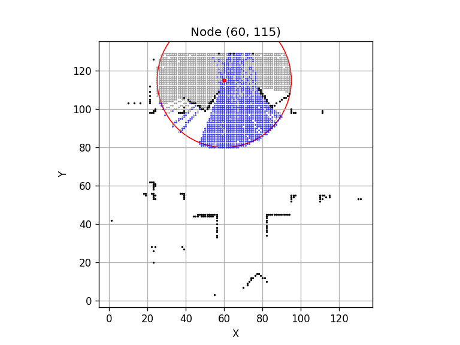
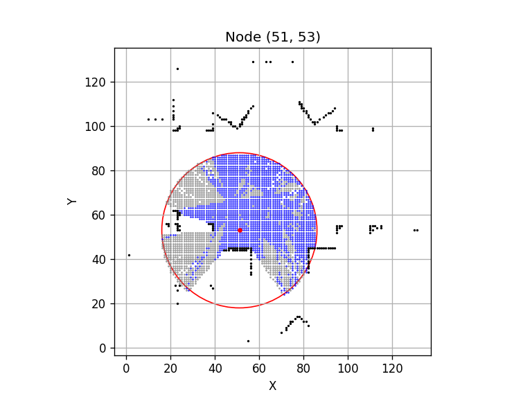
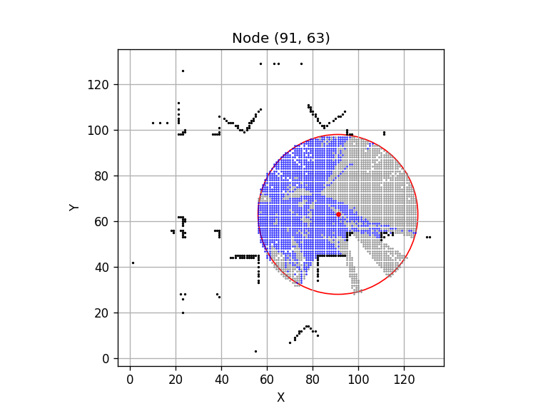
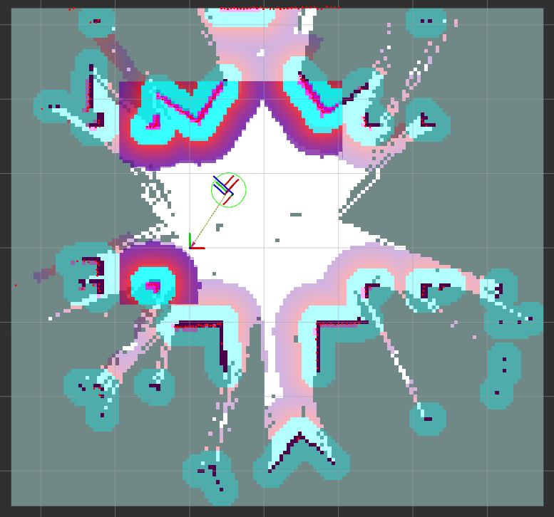
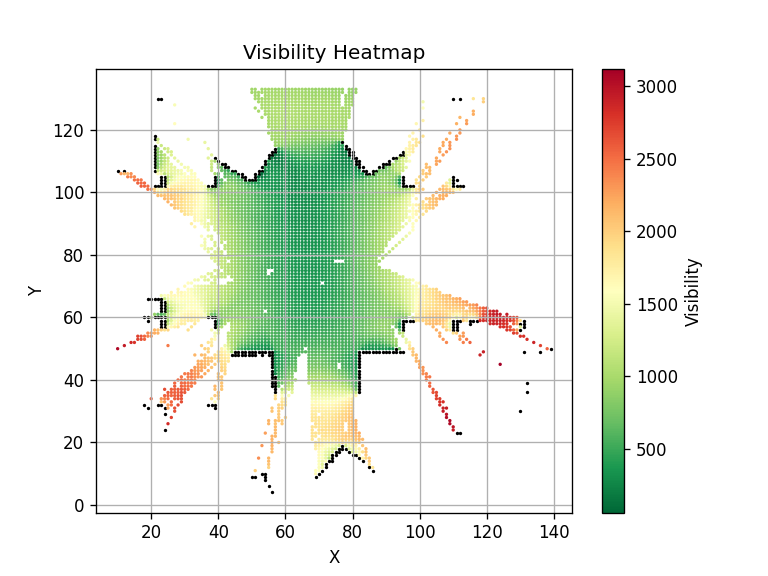
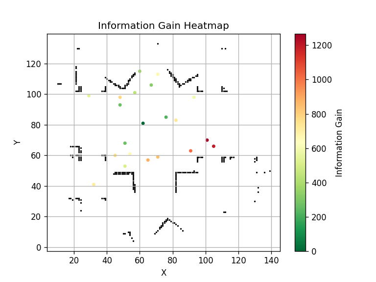

Concepts covered

- Next best view
- Information gain equation
  - Uses Bresenham to find free, obstacle and unknown along ray
- Node distance (euclidean)
- LIDAR map
  - Use Bresenham to find free points along ray
  - Uses robot heading to adjust scan.angle_min

Next-best-view exploration (see [`report_nbv.py`](src/RobotAutonomy/my_turtlebot/report_nbv.py))

```bash
ros2 launch my_turtlebot turtlebot_simulation.launch.py slam:=True

ros2 run my_turtlebot map_lidar

ros2 run turtlebot3_teleop teleop_keyboard

ros2 run my_turtlebot explore_nbv
```

| blue: known free cells | gray: unknown cells |
| -- | -- |
| |  |
|||




| blue: known free cells | gray: unknown cells |
| -- | -- |
| |  |

Question:

- when I load the partial map, it is being read as binary with {0,100} instead of trinary. how do I avoid this?
- why does it make more sense when I set the max range to be $3.5 \div 2$ m? Is the max range half of that?
